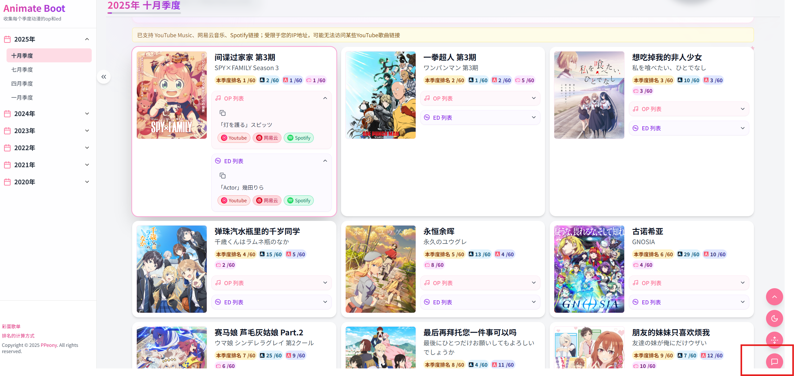

# [animateboot.com](animateboot.com) 收集每个季度的新番op和ed
# 手机没有做额外适配，建议电脑打开
## ui展示

关灯效果

# 功能
## 支持YoutubeMusic，网易云，Spotify

## 计算季度排名，统计中、日、美观看量
- 美国标准是Anilist
- 日本标准是Annict
- 中国标准是Bangumi

点击排名具体信息即可跳转

当前收录到2020年

## 反馈
点击页面右下角按钮即可反馈。

op、ed都是爬虫+大模型+人工校对的，难免有错误，希望大家理解。

# 背景
1. 摸鱼时候会打开网页版的音乐网站听歌。
2. 部分公司直接把网易云域名屏蔽，电脑无法访问，所以需要网易云以外的音乐平台。
3. 动漫歌曲希望有个汇总的地方，而且点击直达，不需要我再去复制名字去搜索。
4. 在十一月的时候，正好换工作，时间开始充裕起来，所以着手开发。

# 其他
网站是从零搭起来的，自己之前没玩过。如果你对背后技术感兴趣，可以访问：[myblog](https://ppeony.github.io/2025/12/15/animateboot%E5%BC%80%E5%8F%91%E6%97%A5%E8%AE%B0/)

# Feature
1. 未来计划加入英语和纯日语，适配多语言。
2. 加入B站视频链接。
